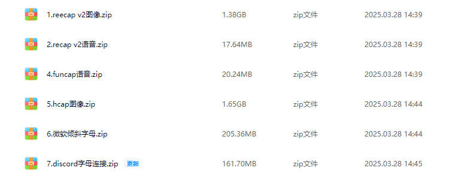
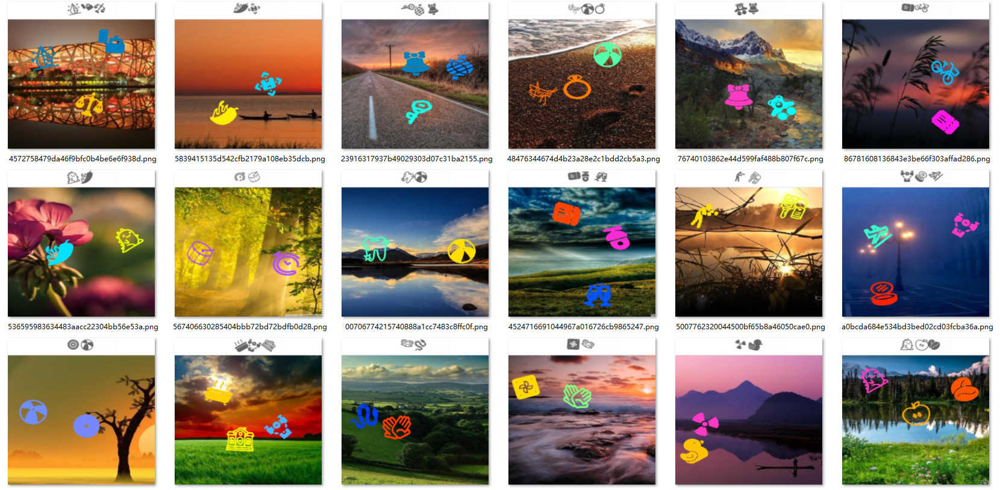
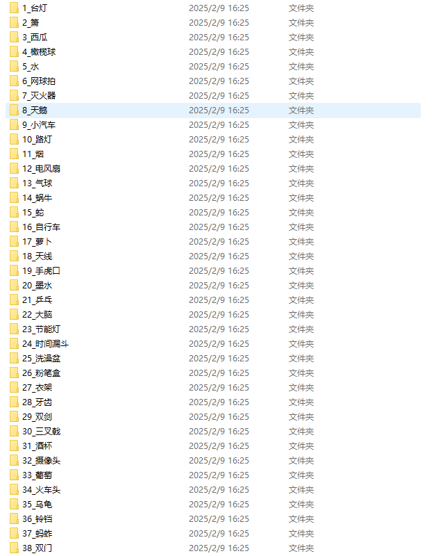
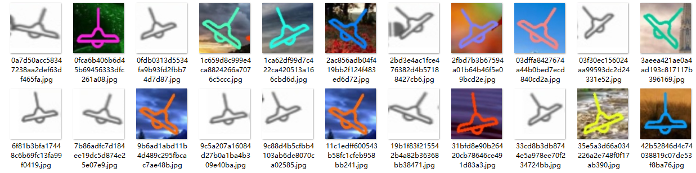

# 声明：本教程只能用于教学目的，如果用于非法目的与本人无关

# --------------- 广告 ---------------
## 本人24个实战视频教程，后续会更新十几个，每个教程都有配套的数据样本，训练代码，成品模型，推测代码，2k出售，有问题可以随时问，详情联系本人：tomysky67



## 试看视频 顶象空间推理.mkv 链接: https://pan.baidu.com/s/1ly-wmD5GMHpwTb2PpF8-ww?pwd=6666 提取码: 6666
# --------------- 广告 ---------------

# 图标点选yolo+siamese

## 1.分析



> ​		要根据上面的提示的图标顺序，点击下面的对应的图标。还是先做目标检测，只不过上面的提示图标和下面的有背景的图标都需要做检测；然后把检测到的图标分割为小图标做分类,分完类做siamese的相似度训练；最后把检测模型和siamese相似度模型组合到一起使用得出结果。

## 2.目标检测

> ​	把上面的图标和下面的图标都做检测，不过需要分为两类，上面指定为text类，下面指定为target类，方便后续进行处理。

**target.yaml**

```yaml
train: train/images # train images (relative to 'path') 128 images
val: val/images # val images (relative to 'path') 128 images

nc: 2
names: ["text","target"]

```

**train.py**

```python
from ultralytics import YOLO

def train_model():
    # 加载YOLOv8模型
    model = YOLO('yolo11m.pt')  
    # 开始训练
    model.train(
        data='./target.yaml',  # 数据集的配置文件
        epochs=600,                        # 训练的轮数
        imgsz=640,                         # 输入图像的尺寸
        batch=16,                          # 批处理大小
        device='0',                        # 使用的GPU设备编号
        patience=600
          )

    # 评估模型
    model.val()

    # 导出模型
    model.export(format='onnx')  # 你可以选择其他格式，如'onnx', 'coreml', 'tflite', 等等

if __name__ == '__main__':
    import multiprocessing
    multiprocessing.freeze_support()  # 确保在Windows系统上正确启动多进程
    train_model()
```

## 3.siamese训练

> ​	第一步需要分割小图标，上面的提示小图标和下面的有背景的小图标都分割到一起，然后进行分类。

**分割代码：**

```python
# -*- coding: utf-8 -*-
import os
from ultralytics import YOLO
import cv2

num = 0
# 加载 ONNX 模型
model = YOLO('best.pt')

def resize_save_image(image,new_path):
    # 调整大小
    new_image = cv2.resize(image,(128,128))

    # 保存到新的路径
    cv2.imwrite(new_path,new_image)

def predict_and_draw_boxes(image_path):
    global num
    # 读取图像
    image = cv2.imread(image_path)
    image = cv2.resize(image,(640,640))
    if image is None:
        print(f"Error: Image at {image_path} could not be loaded.")
        return

    # 进行预测
    results = model(image)

    # 解析和显示结果
    boxes = results[0].boxes.xyxy  # 获取所有预测框的坐标
    classes = results[0].boxes.cls  # 获取所有预测框的类别
    confidences = results[0].boxes.conf  # 获取所有预测框的置信度
    for i, box in enumerate(boxes):
        x1, y1, x2, y2 = map(int, box)  # 转换为整数坐标

        class_id = int(classes[i].item())  # 类别ID
        confidence = confidences[i].item()
        if confidence<0.7:
            continue
        cropped_img = image[y1:y2, x1:x2]
        new_path = "splited_images/{}.jpg".format(str(num))
        num += 1
        resize_save_image(cropped_img,new_path)


if __name__ == '__main__':
    base_dir = r""
    files = os.listdir(base_dir)
    for index,file in enumerate(files):
        file = base_dir + "/"+file
        print("No {} file:{}".format(str(index),file))
        predict_and_draw_boxes(file)


```

> ​	分割好了之后对图标进行手动或者半自动的分类，分好的效果如下：





> ​	这时候就可以进行siamese相似度训练了，代码如下：

**siamese_train.py**

```python
import warnings
warnings.filterwarnings("ignore", category=UserWarning)  # 忽略所有 UserWarning
# warnings.filterwarnings("ignore") # 忽略所有类型的warning，更简单
import os
import random
import numpy as np
from tqdm import tqdm
import torch
import torch.nn as nn
import torch.nn.functional as F
from torch.utils.data import Dataset, DataLoader
from torchvision import transforms
from PIL import Image, ImageOps
import onnxruntime as ort

# --- 1. 数据准备 (包含正负样本均衡的 SiameseDataset, 修正了划分和空列表问题) ---

class SiameseDataset(Dataset):
    def __init__(self, root_dir, transform=None, should_invert=False, train=True, split_ratio=0.8):
        self.root_dir = root_dir
        self.transform = transform
        self.should_invert = should_invert
        self.train = train
        self.split_ratio = split_ratio
        self.classes, self.class_to_idx, self.imgs = self.get_all_data()  # 获取所有数据
        self.build_index()  # 构建完整索引
        self.split_data()  # 划分训练/验证集


    def get_all_data(self):
        # 和 get_data 代码基本一样, 但不划分数据集
        classes = sorted(entry.name for entry in os.scandir(self.root_dir) if entry.is_dir())
        if not classes:
            raise FileNotFoundError(f"Couldn't find any class folder in {self.root_dir}.")

        class_to_idx = {cls_name: i for i, cls_name in enumerate(classes)}
        imgs = []
        for class_name in classes:
            class_dir = os.path.join(self.root_dir, class_name)
            for img_name in os.listdir(class_dir):
                img_path = os.path.join(class_dir, img_name)
                imgs.append((img_path, class_to_idx[class_name]))
        return classes, class_to_idx, imgs

    def build_index(self):
        self.index = {}
        for class_name in self.classes:
            self.index[class_name] = []
        for img_path, class_idx in self.imgs:  # 这里使用全部的self.imgs
            class_name = self.classes[class_idx]
            self.index[class_name].append(img_path)
        # 打印检查
        # for class_name, img_paths in self.index.items():
        #     print(f"Class: {class_name}, Number of images: {len(img_paths)}")
        #     if not img_paths:
        #         print(f"WARNING: Class {class_name} has no images!")

    def split_data(self):
        # 打乱并划分数据集
        random.shuffle(self.imgs)
        split_idx = int(len(self.imgs) * self.split_ratio)
        if self.train:
            self.imgs = self.imgs[:split_idx]
        else:
            self.imgs = self.imgs[split_idx:]
        # print(f"Number of images in {'train' if self.train else 'val'} set: {len(self.imgs)}")
        # 打印 imgs 的前几个元素，检查
        # print("Sample images:", self.imgs[:5])


    def __getitem__(self, index):
        img0_tuple = self.imgs[index]
        img0_path, img0_label = img0_tuple
        img0_class = self.classes[img0_label]

        should_get_same_class = random.randint(0, 1)

        if should_get_same_class:
            img1_path = random.choice(self.index[img0_class])
            while img1_path == img0_path:  # 避免选择同一张图片
                img1_path = random.choice(self.index[img0_class])
            img1_label = img0_label
        else:
            other_classes = [c for c in self.classes if c != img0_class]
             # 循环，直到找到一个非空的类别
            while True:
                img1_class = random.choice(other_classes)
                if self.index[img1_class]:  # 如果列表不为空
                    break
                else:  # 如果other_classes里面所有的类别的图片列表都为空，避免死循环
                    other_classes.remove(img1_class)
                    if not other_classes:
                       raise ValueError(f"No other classes with images available besides: {img0_class}")

            img1_path = random.choice(self.index[img1_class])
            img1_label = self.class_to_idx[img1_class]


        img0 = Image.open(img0_path).convert("RGB")
        img1 = Image.open(img1_path).convert("RGB")

        if self.should_invert:
            img0 = ImageOps.invert(img0)
            img1 = ImageOps.invert(img1)

        if self.transform is not None:
            img0 = self.transform(img0)
            img1 = self.transform(img1)

        return img0, img1, torch.from_numpy(np.array([int(img1_label != img0_label)], dtype=np.float32))

    def __len__(self):
        return len(self.imgs)

# --- 2. 模型定义 (ResNet50 作为骨干的 Siamese 网络) ---

class SiameseNetwork(nn.Module):
    def __init__(self):
        super(SiameseNetwork, self).__init__()
        self.resnet = torch.hub.load('pytorch/vision:v0.9.0', 'resnet50', pretrained=True)
        self.resnet = nn.Sequential(*list(self.resnet.children())[:-1])
        self.fc = nn.Sequential(
            nn.Linear(2048, 512),
            nn.ReLU(inplace=True),
            nn.Linear(512, 256),
            nn.ReLU(inplace=True),
            nn.Linear(256, 128),
        )

    def forward_once(self, x):
        output = self.resnet(x)
        output = output.view(output.size()[0], -1)
        output = self.fc(output)
        return output

    def forward(self, input1, input2):
        output1 = self.forward_once(input1)
        output2 = self.forward_once(input2)
        return output1, output2

# --- 定义Contrastive Loss ---

class ContrastiveLoss(torch.nn.Module):
    def __init__(self, margin=2.0):
        super(ContrastiveLoss, self).__init__()
        self.margin = margin

    def forward(self, output1, output2, label):
        euclidean_distance = F.pairwise_distance(output1, output2, keepdim=True)
        loss_contrastive = torch.mean((1 - label) * torch.pow(euclidean_distance, 2) +
                                       (label) * torch.pow(torch.clamp(self.margin - euclidean_distance, min=0.0), 2))
        return loss_contrastive

# --- 3. 训练和验证 ---

def train_and_validate(data_dir, epochs=25, margin=2.0, batch_size=32):
    # 数据增强和预处理 (使用 128x128 输入, 并添加更多数据增强)
    transformation = transforms.Compose([
        transforms.Resize((128, 128)),  # 先稍微放大一点
        transforms.ToTensor(),
        transforms.Normalize(mean=[0.485, 0.456, 0.406], std=[0.229, 0.224, 0.225])
    ])


    train_dataset = SiameseDataset(root_dir=data_dir, transform=transformation, train=True)
    val_dataset = SiameseDataset(root_dir=data_dir, transform=transformation, train=False)

    train_dataloader = DataLoader(train_dataset, shuffle=True, batch_size=batch_size)
    val_dataloader = DataLoader(val_dataset, shuffle=False, batch_size=batch_size)

    device = torch.device("cuda" if torch.cuda.is_available() else "cpu")

    net = SiameseNetwork().to(device)
    criterion = ContrastiveLoss(margin=margin)

    optimizer = torch.optim.SGD(net.parameters(), lr=0.01, momentum=0.9, weight_decay=0.001)
    scheduler = torch.optim.lr_scheduler.ReduceLROnPlateau(optimizer, 'min', patience=5, factor=0.5, verbose=True)

    best_accuracy = 0.0

    # 创建 models 目录 (如果不存在)
    if not os.path.exists("models"):
        os.makedirs("models")

    for epoch in range(epochs):
        net.train()
        running_loss = 0.0
        train_loop = tqdm(train_dataloader, leave=True)
        for i, (img0, img1, label) in enumerate(train_loop):
            img0, img1, label = img0.to(device), img1.to(device), label.to(device)

            optimizer.zero_grad()
            output1, output2 = net(img0, img1)
            loss = criterion(output1, output2, label)
            loss.backward()
            optimizer.step()

            running_loss += loss.item()
            train_loop.set_description(f"Epoch [{epoch+1}/{epochs}]")
            train_loop.set_postfix(loss=loss.item())

        print(f"Epoch {epoch+1}, Training loss: {running_loss/len(train_dataloader):.4f}")

        net.eval()
        val_loss = 0.0
        correct_predictions = 0
        total_samples = 0
        with torch.no_grad():
            val_loop = tqdm(val_dataloader, leave=True)
            for img0, img1, label in val_loop:
                img0, img1, label = img0.to(device), img1.to(device), label.to(device)
                output1, output2 = net(img0, img1)
                loss = criterion(output1, output2, label)
                val_loss += loss.item()

                euclidean_distance = F.pairwise_distance(output1, output2)
                pred = (euclidean_distance > 0.5).float()  # 调整阈值
                correct_predictions += (pred == label.squeeze()).sum().item()
                total_samples += label.size(0)

                val_loop.set_description("Validating")
                val_loop.set_postfix(loss=loss.item())

        avg_val_loss = val_loss / len(val_dataloader)
        accuracy = correct_predictions / total_samples * 100
        print(f"Epoch {epoch+1}, Validation loss: {avg_val_loss:.4f}, Accuracy: {accuracy:.2f}%")
        # 保存到 models 目录下
        model_path = os.path.join("models", f"siamese_resnet50_epoch_{epoch+1}.pth")
        torch.save(net.state_dict(), model_path)
        print(f"Model saved at {model_path}")

        if accuracy > best_accuracy:
            best_accuracy = accuracy
            best_model_path = os.path.join("models", "best_siamese_resnet50.pth")  # 保存到 models 目录下
            torch.save(net.state_dict(), best_model_path)
            print(f"Best model (accuracy) updated and saved at {best_model_path}")

            # 导出为 ONNX (使用 128x128 输入)
            dummy_input1 = torch.randn(1, 3, 128, 128).to(device)  # 修改为 128x128
            dummy_input2 = torch.randn(1, 3, 128, 128).to(device)  # 修改为 128x128
            onnx_path = os.path.join("models", "best_siamese_resnet50.onnx")  # 保存到 models 目录下
            torch.onnx.export(
                net,
                (dummy_input1, dummy_input2),
                onnx_path,
                export_params=True,
                opset_version=17,
                do_constant_folding=True,
                input_names=['input1', 'input2'],
                output_names=['output1', 'output2'],
                dynamic_axes={'input1': {0: 'batch_size'}, 'input2': {0: 'batch_size'},
                              'output1': {0: 'batch_size'}, 'output2': {0: 'batch_size'}}
            )
            print(f"Best model exported to ONNX at {onnx_path}")

            try:
                ort_session = ort.InferenceSession(onnx_path, providers=['CUDAExecutionProvider', 'CPUExecutionProvider'])
                ort_inputs = {
                    'input1': np.random.randn(1, 3, 128, 128).astype(np.float32),  # 修改为 128x128
                    'input2': np.random.randn(1, 3, 128, 128).astype(np.float32)   # 修改为 128x128
                }
                ort_outs = ort_session.run(None, ort_inputs)
                print("ONNX model validation successful.")
            except Exception as e:
                print(f"ONNX model validation failed: {e}")
        scheduler.step(avg_val_loss)  # 根据验证损失调整学习率
# --- 4. 主函数 ---

if __name__ == "__main__":
    data_directory = "datasets"  # 你的数据文件夹
    train_and_validate(data_directory, epochs=50, margin=2.0, batch_size=64)
```

## 4.加载训练好的模型做预测

> ​	先用yolo检测目标，把检测的图标截取出来，然后用siamese计算相似度，根据上面提示图标的分类，把下面对应分类的目标图标排序，得出结果。

**yolo预测代码**

```python
import os
import random
import uuid
import cv2
from tqdm import tqdm
from ultralytics import YOLO

def predict_and_draw_boxes(image_path, model, save_result=False, output_path='output.jpg'):
    # 读取图像
    image = cv2.imread(image_path)
    # image = cv2.resize(image,(640,640))
    if image is None:
        print(f"Error: Image at {image_path} could not be loaded.")
        return

    # 进行预测
    results = model(image)

    # 解析和显示结果
    boxes = results[0].boxes.xyxy  # 获取所有预测框的坐标
    classes = results[0].boxes.cls  # 获取所有预测框的类别
    confidences = results[0].boxes.conf  # 获取所有预测框的置信度

    for i, box in enumerate(boxes):
        x1, y1, x2, y2 = map(int, box)  # 转换为整数坐标

        class_id = int(classes[i].item())  # 类别ID

        confidence = confidences[i].item()  # 置信度
        if confidence<0.5:
            continue
        centre_x = (x1 + x2)/2
        centre_y = (y1 + y2)/2
        print("centre point:",(centre_x,centre_y))
        cv2.rectangle(image, (x1_expanded, y1_expanded), (x2_expanded, y2_expanded), (255, 255, 0), 2)  # 绘制矩形框
        label = f'{model.names[class_id]} {confidence:.2f}'
        cv2.putText(image, label, (x1, y2 + 15), cv2.FONT_HERSHEY_SIMPLEX, 0.5, (255, 0, 0), 2)

    # # 显示结果图像
    cv2.imshow('Prediction', image)
    cv2.waitKey(0)
    cv2.destroyAllWindows()


if __name__ == '__main__':
    model_path = 'best.pt'  # 替换为你的模型路径
    model = YOLO(model_path)
    base_dir = "images"
    files = os.listdir(base_dir)
    for file in tqdm(files):
        filename = os.path.join(base_dir, file)
        print(filename)
        predict_and_draw_boxes(filename, model)

```

**siamese预测代码：**

```python
import onnxruntime as ort
import numpy as np
from PIL import Image
from torchvision import transforms


def preprocess_image(image_path):
    """
    预处理图像：加载、调整大小、转换为张量、归一化。
    """
    transformation = transforms.Compose([
        transforms.Resize((128, 128)),
        transforms.ToTensor(),
        transforms.Normalize(mean=[0.485, 0.456, 0.406], std=[0.229, 0.224, 0.225])
    ])
    image = Image.open(image_path).convert("RGB")
    return transformation(image).unsqueeze(0)  # 添加批次维度


def predict_with_onnx(onnx_model_path, image1_path, image2_path):
    """
    使用 ONNX 模型进行预测。

    Args:
        onnx_model_path: ONNX 模型的路径。
        image1_path: 第一张图像的路径。
        image2_path: 第二张图像的路径。

    Returns:
        一个元组: (output1, output2, distance, similarity_prediction)，
        分别表示两个图像的特征向量、它们之间的欧氏距离以及相似度预测（0 或 1）。
    """

    # 创建 ONNX Runtime 推理会话
    ort_session = ort.InferenceSession(onnx_model_path, providers=['CUDAExecutionProvider', 'CPUExecutionProvider'])

    # 预处理图像
    input1 = preprocess_image(image1_path)
    input2 = preprocess_image(image2_path)

    # 转换为 NumPy 数组，并确保数据类型为 float32
    input1_np = input1.numpy().astype(np.float32)
    input2_np = input2.numpy().astype(np.float32)

    # 运行推理
    ort_inputs = {'input1': input1_np, 'input2': input2_np}
    ort_outs = ort_session.run(None, ort_inputs)

    # 获取输出 (特征向量)
    output1, output2 = ort_outs

    # 计算欧氏距离
    distance = np.linalg.norm(output1 - output2)

    # 基于距离进行相似度预测 (可以调整阈值)
    threshold = 0.5  # 这是一个示例阈值，您可能需要根据验证集调整
    similarity_prediction = 0 if distance < threshold else 1

    return output1, output2, distance, similarity_prediction


def predict_with_onnx_batch(onnx_model_path, image_pairs):
    """
    使用ONNX模型进行批量预测

    Args:
        onnx_model_path: ONNX模型路径
        image_pairs: 一个列表，每个元素是一个元组，包含两个图片的路径

    Returns:
        一个列表，每个元素是一个元组: (output1, output2, distance, similarity_prediction)
    """

    # 创建ONNX Runtime 推理会话
    ort_session = ort.InferenceSession(onnx_model_path, providers=['CUDAExecutionProvider', 'CPUExecutionProvider'])

    results = []
    for img1_path, img2_path in image_pairs:
        # 预处理图像
        input1 = preprocess_image(img1_path)
        input2 = preprocess_image(img2_path)

        # 转换为NumPy数组
        input1_np = input1.numpy().astype(np.float32)
        input2_np = input2.numpy().astype(np.float32)

        # 执行推理
        ort_inputs = {'input1': input1_np, 'input2': input2_np}
        ort_outs = ort_session.run(None, ort_inputs)

        output1, output2 = ort_outs

        # 计算距离
        distance = np.linalg.norm(output1 - output2)

        # 相似度预测
        threshold = 0.5
        similarity_prediction = 0 if distance < threshold else 1

        results.append((output1, output2, distance, similarity_prediction))

    return results


if __name__ == '__main__':
    # 使用示例
    onnx_model_path = "model_data/best_siamese_resnet50.onnx"  # 替换为你的 ONNX 模型路径
    image1_path = "1.png"  # 替换为第一张图像的路径
    image2_path = "2.png"  # 替换为第一张图像的路径
    # image2_path = "3.png"  # 替换为第二张图像的路径

    # 单张预测
    output1, output2, distance, similarity = predict_with_onnx(onnx_model_path, image1_path, image2_path)

    # print(f"Image 1 Feature Vector: {output1}")
    # print(f"Image 2 Feature Vector: {output2}")
    print(f"Euclidean Distance: {distance}")
    print(f"Similarity Prediction (0: similar, 1: dissimilar): {similarity}")

    # # 批量预测示例
    # image_pairs = [
    #     ("path/to/image1.jpg", "path/to/image2.jpg"),
    #     ("path/to/image3.jpg", "path/to/image4.jpg"),
    #     # ... 更多图像对
    # ]
    # batch_results = predict_with_onnx_batch(onnx_model_path, image_pairs)
    #
    # for i, (output1, output2, distance, similarity) in enumerate(batch_results):
    #     print(f"Pair {i + 1}:")
    #     print(f"  Image 1 Feature Vector: {output1}")
    #     print(f"  Image 2 Feature Vector: {output2}")
    #     print(f"  Euclidean Distance: {distance}")
    #     print(f"  Similarity Prediction (0: similar, 1: dissimilar): {similarity}")
```

